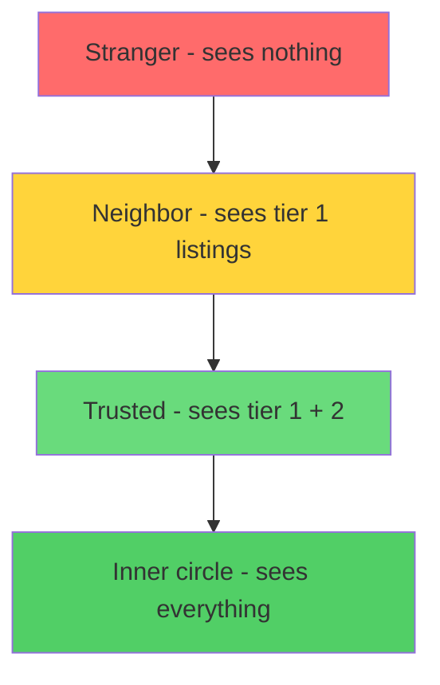

# blockroll


nextdoor but without the part where a corporation owns all your data and your neighbor Karen can see your entire profile.

blockroll is a single Go binary that runs a web app for your neighborhood. people register with a join code, list skills and stuff they can share (lawnmower, baking, that projector nobody uses), and control exactly who sees what through trust tiers. you decide per person how much of your inventory is visible. no app store, no subscription, no data harvesting.

## How it works

You create listings (a skill, a tool, food, whatever) and tag each one with a visibility tier:

| Tier | Name | Who sees it |
|------|------|-------------|
| 0 | Public | Anyone in the neighborhood |
| 1 | Neighbor | People you've acknowledged |
| 2 | Trusted | People you've specifically promoted |
| 3 | Inner Circle | Your closest people |

Trust is one way. You set a tier for each neighbor independently. If you trust someone at tier 2, they see your tier 0, 1, and 2 listings. They still have to trust you back separately for you to see theirs. No mutual handshake required, no forced reciprocity.

If nobody has set a trust level for you yet, you only see their public (tier 0) stuff.


## how trust tiers work



```
$ curl localhost:8080/api/listings?viewer=sam

[
  {"item": "lawnmower", "owner": "alex", "tier": 1},
  {"item": "stand mixer", "owner": "jordan", "tier": 1},
  {"item": "chest freezer", "owner": "alex", "tier": 2}
]

# sam is "trusted" by alex (tier 2) so sees the freezer
# sam is only "neighbor" to jordan (tier 1) so only sees the mixer
```

## What you need

- Go 1.22 or newer ([go.dev/dl](https://go.dev/dl/))
- That's it. SQLite is compiled in through `modernc.org/sqlite`, pure Go, no CGO, no system libraries.

## Getting it running

```bash
git clone https://github.com/zandenkane/blockroll.git
cd blockroll
go build ./cmd/blockroll-server
go build ./cmd/blockroll-cli
```

Or just `make build` if you have Make.

Start the server:

```bash
./blockroll-server
```

That listens on port 8080 and creates a `blockroll.db` file in the current directory. Open `http://localhost:8080`, register an account, create your neighborhood, and share the 6 character join code with your people.

You can customize the port and database path:

```bash
./blockroll-server -addr :3000
./blockroll-server -db /var/data/blockroll.db
```

Environment variables work too: `BLOCKROLL_ADDR` and `BLOCKROLL_DB`.

There's a health check at `/health` that returns `{"status":"ok"}` if the database is reachable.

## The CLI

There's also a command line tool for poking at things without the browser:

```bash
# Create users
./blockroll-cli create-user alice@example.com password123
./blockroll-cli create-user bob@example.com password456

# Alice starts a neighborhood
./blockroll-cli create-neighborhood "Elm Street" alice@example.com

# Bob joins with the code Alice got
./blockroll-cli join-neighborhood ABC123 bob@example.com

# Alice lists some stuff at different trust levels
./blockroll-cli add-listing alice@example.com "Elm Street" "Chainsaw" tool 1
./blockroll-cli add-listing alice@example.com "Elm Street" "Baking skills" skill 0
./blockroll-cli add-listing alice@example.com "Elm Street" "Spare bedroom" other 3

# Alice decides Bob is trusted at tier 2
./blockroll-cli set-trust alice@example.com bob@example.com 2

# Bob can now see Alice's tier 0, 1, and 2 listings
./blockroll-cli view-listings "Elm Street" bob@example.com

# Remove something
./blockroll-cli remove-listing alice@example.com "Elm Street" "Chainsaw"

# Check the numbers
./blockroll-cli stats "Elm Street"
```

## Running the tests

```bash
go test ./...
go vet ./...
```

Or `make test` and `make vet`.

## Project layout

```
cmd/blockroll-server/    web server, router, session middleware
cmd/blockroll-cli/       command line tool for working with the store directly
pkg/privacy/             the visibility predicate and tier constants
pkg/store/               SQLite database, schema, all queries
pkg/handler/             HTTP handlers for auth, listings, trust, neighborhoods
web/templates/           HTML templates (embedded in the binary at build time)
web/static/css/          stylesheet with light and dark mode (also embedded)
```

## Author

Zanden Kane

## License

MIT. See [LICENSE](LICENSE).
